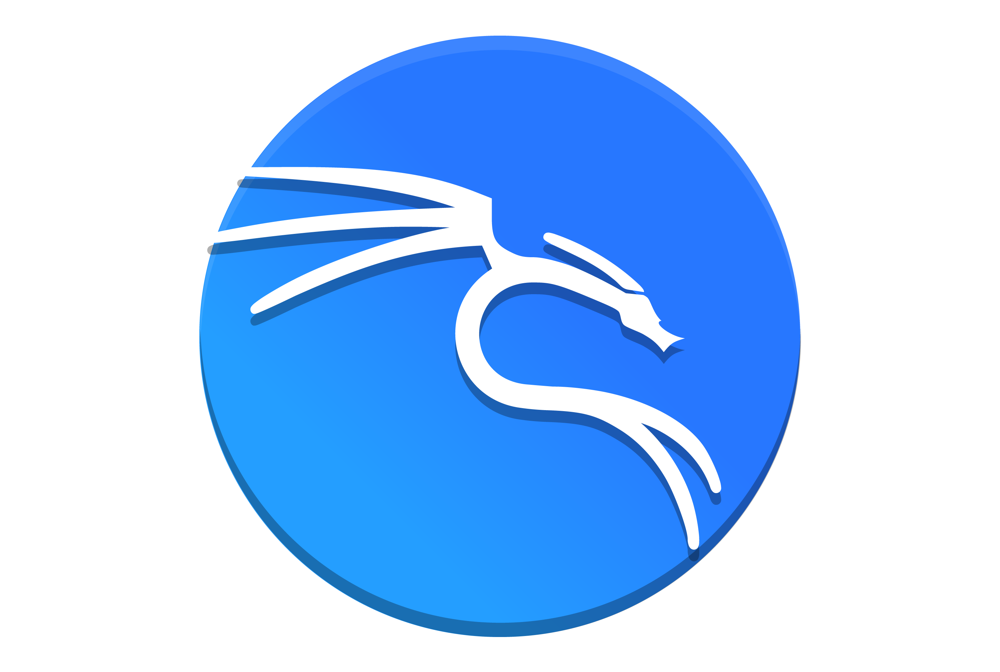

<h1 align="center">Hi there, I am Mateusz Śliwowski</h1>
<h3 align="center">Fullstack developer. Cyber security passionate.</h3>

## About me

I’m passionate about web development and continuously expand my skills by learning new technologies and building demo projects — each one incorporating the latest concepts I've explored. I'm also deeply interested in cybersecurity, especially web application security, and regularly deepen my knowledge in this area. In my free time, I enjoy reading books and catching up on the latest news from streaming platforms. 😊

## Tech stack:

### Development stack:

  &nbsp;&nbsp;
  React.js

  &nbsp;&nbsp;
  Express.js

  &nbsp;&nbsp;
  JavaScript ES6+

  &nbsp;&nbsp;
  TypeScript

  &nbsp;&nbsp;
  Tailwind CSS

  &nbsp;&nbsp;
  SQL

  &nbsp;&nbsp;
  GIT

### DevOps stack:

  &nbsp;&nbsp;
  Linux

  &nbsp;&nbsp;
  NGINX

  &nbsp;&nbsp;
  Docker

  &nbsp;&nbsp;
  Jenkins

  &nbsp;&nbsp;
  phpMyAdmin

### Security:

  &nbsp;&nbsp;
  OWASP Top 10

  &nbsp;&nbsp;
  Kali Linux

  &nbsp;&nbsp;
  Burp Suite

  &nbsp;&nbsp;
  Secure Headers & CORS

  &nbsp;&nbsp;
  Manual Penetration Testing

  &nbsp;&nbsp;
  Automated Security Testing

## What I'm currently working on?

I’m currently learning both Python and Next.js. I chose Next.js because it’s a natural extension of React.js, enabling me to build full-stack applications. This will allow me to move away from using Express.js solely as an API and explore new solutions. As for Python, it’s a versatile language that can be used for backend development, creating pentesting payloads, and building auxiliary applications on a VPS.

## Future plans

In the future, once I’m more familiar with Next.js, I plan to refactor my portfolio application. It’s the first app I built using React.js, and it needs a thorough update. Additionally, I am actively looking for work. While I don’t have commercial experience as a web developer yet, I believe my demo projects will be well-received by potential employers.
